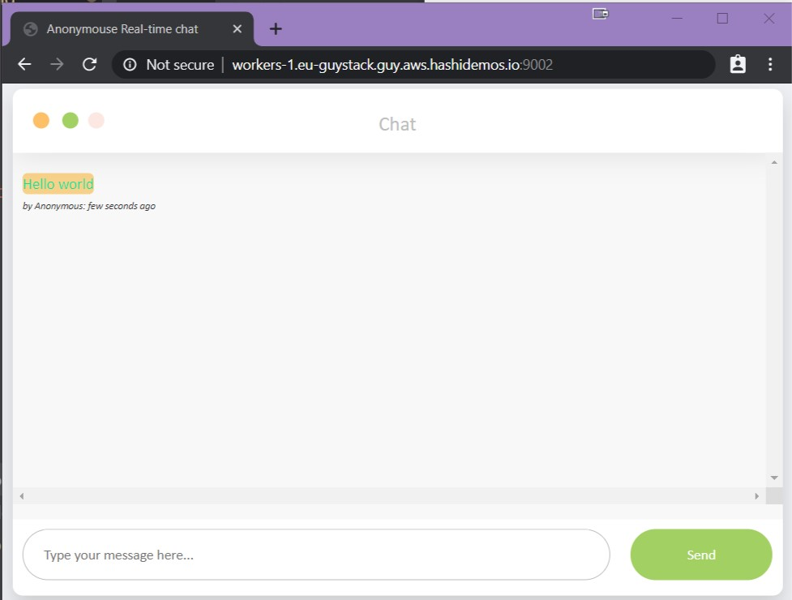
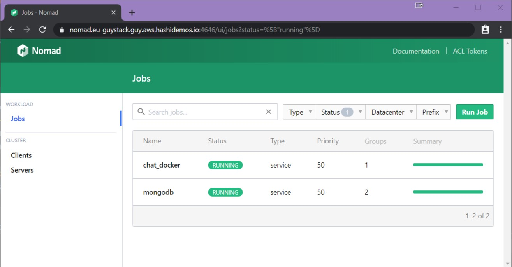
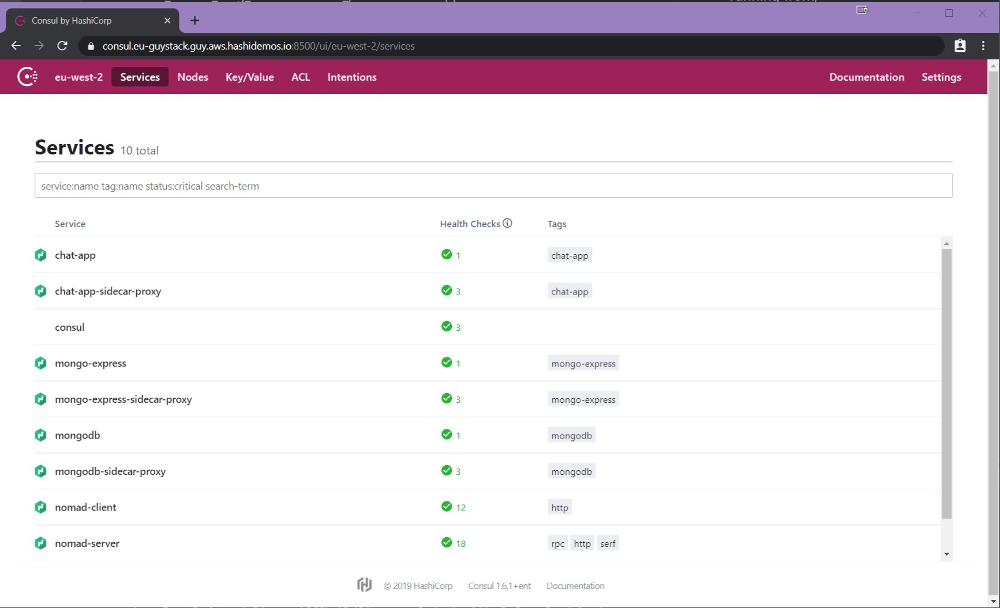

# Nomad 0.10 - just the new bits

This repository contains examples of the following new features released in Nomad 0.10.0:

* Host mount volumes
* Advanced Networking
* Consul Connect sidecar injection


To visualise the new features for Nomad 0.10.0 we will implement the following jobs:

* [**MongoDB**](https://hub.docker.com/_/mongo)(Docker,service job) database
* [**Chat App**](https://github.com/GuyBarros/anonymouse-realtime-chat-app)(Docker,service job) nodejs frontend

### Pre Requisites

* Nomad 0.10.x cluster
* Consul cluster with connect enabled.
* CNI [plugins](https://github.com/containernetworking/plugins/releases/tag/v0.8.2) and installed in `/opt/cni/bin`
* Docker (Nomad launches a Consul Connect Envoy sidecar using the official Envoy [docker container](https://hub.docker.com/u/envoyproxy))

#### included enviroment

in the [terraform](./terraform/) directory there is code to spin up an environment with Nomad preconfigured. this takes a couple of minutes to get up and running correctly, after that, from the nomad_jobs directory, run:


   1. cni_bash.nomad
   2. consul_bash.nomad
   3. envoy_bash.nomad
   4. consul.nomad
   5. consul.nomad
   6. mongodb.nomad
   7. chatapp.nomad


---

## Host volumes

Host volumes are Nomad's current answer to mounted volumes, the idea behind them is you give a directory an identifier, then this identifier can be called from the jobspec and used to host the service's data. this way, as long as the identifier is the same and the data can be reached from different hosts, stateful applications will continue to have access to their data regardless of where they are allocated.

To set up mount volumes, we must first create the host volume identifier in the [Nomad node client](https://www.nomadproject.io/docs/configuration/client.html#host_volume-stanza) stanza config.

This can be achieved in two ways:

* Directly in the main **config.hcl** document located in `/etc/nomad.d/`
* Seperate document **some_document.hcl** in the same directory

```bash
host_volume "mongodb_mount" {
  path      = "/opt/mongodb/data/"
  read_only = false
}
```

and then we call this identifier from the jobspec:

```bash
group "db" {
 count = 1
 volume "mongodb_vol" {
 type = "host"
 source = "mongodb_mount"
 }

 task "mongodb" {
    driver = "docker"
    env {
      "MONGO_INITDB_ROOT_USERNAME" = "root"
      "MONGO_INITDB_ROOT_PASSWORD" = "example"
    }
     volume_mount {
      volume      = "mongodb_vol"
      destination = "/data/db"
    }
```

The directory you are using must exist beforehand and be accesible by the user/group Nomad is running under.

[Reference: Stateful Workloads with Nomad Host Volumes](https://www.nomadproject.io/guides/stateful-workloads/host-volumes.html)

### Limitations

* The consul binary must be in Nomad's $PATH to run the envoy proxy sidecars
* Consul Connect Native is not supported yet.
* Consul Connect HTTP and gRPC checks are not yet supported.
* Consul ACLs are not yet supported.
* Only the Docker, exec, and raw exec drivers support network namespaces and Connect.
* Variable interpolation for group services and checks are not yet supported.

---

## Advanced Networking

In previous versions of Nomad when you wanted to specify the networking necessities of your service, all you needed to put in was the port and the bandwidth requirements(in MBits).
Nomad 0.10.0 gives you a new configuration variable called **mode**. [from the documentation](https://www.nomadproject.io/docs/job-specification/network.html#network-parameters):


* **mode (string: "host")** - Mode of the network. The following modes are available:
  - **“none”** - Task group will have an isolated network without any network interfaces.
  - **“bridge”** - Task group will have an isolated network namespace with an interface that is bridged with the host. Note that bridge networking is only currently supported for the >docker, exec, raw_exec, and java task drivers.
  - **“host”** - Each task will join the host network namespace and a shared network namespace is not created. This matches the current behavior in Nomad 0.9.


In our MongoDB job, we want all traffic to go through Consul Connect. To achieve this we need to configure the job to use **bridged** networking. We will need to move the network stanza from the **task** and move it to the **group** stanza.

##### Mongodb.nomad:
```bash
group "db" {
    count = 1
    volume "mongodb_vol" {
      type = "host"
      source = "mongodb_mount"
    }
    network {
      mode = "bridge"
    }

    ...
```

##### chatapp.nomad:
```bash
 network {
      mode = "bridge"
      port "http" {
        static = 9002
        to     = 5000
      }
    }
```
Consul is HashiCorp's Service Mesh solution, as is known for its ease of use and cross datacenter capabilities. It allows services from one DC to talk to another DC seemlessly. You can read more about Consul [here](https://www.consul.io/mesh.html).

Nomad jobs can have an automatic consul connect proxy injected into them, this allows any job to become mesh enabled. In the service stanzas we add the consul sidecar proxy config:

##### Mongodb.nomad:

```bash
 service {
      name = "mongodb"
      tags = ["mongodb"]
      port = "27017"
      connect {
        sidecar_service {}
      }
    }
```

in our chat-app job, we need to add the mongodb service as an upstream:

##### chatapp.nomad:

```bash
service {
      name = "chat-app"
      tags = ["chat-app"]
      port = "http"
      connect {
        sidecar_service {
          proxy {
            upstreams {
              destination_name = "mongodb"
              local_bind_port = 27017
            }
          }
        }
      }
    }

```


---

## Result

Our chat application should be accessible via port 9002 from the host its running from.

##### Chat App


##### Nomad UI


##### Consul UI


In Consul not only can we see all the Nomad servers and clients, we can also see the sidecar proxy (and a nifty little icon) for all the jobs we deployed with Nomad.

In the next blog, we'll take this app across datacenters and look at the new Spread feature; along side some nifty layer 7 routing with Consul Connect. 

#### Special thanks

[Eze Sunday](https://github.com/ezesundayeze/anonymouse-realtime-chat-app) who I forked the chat app from.

My friend and colleague [Lance Haig](https://github.com/lhaig/) who helped me write this.

and to another good friend [Nico "el jefe" Corrarello](https://github.com/ncorrare/) who makes everything in life look easy.


